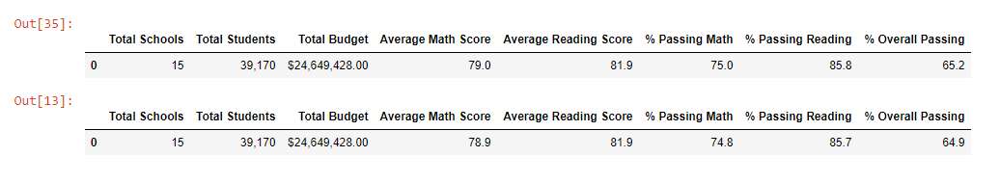
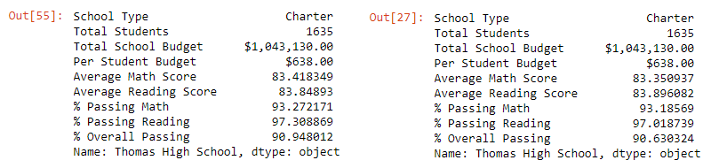
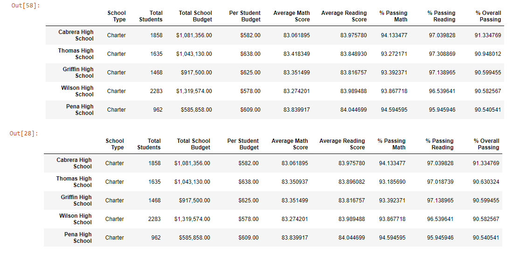
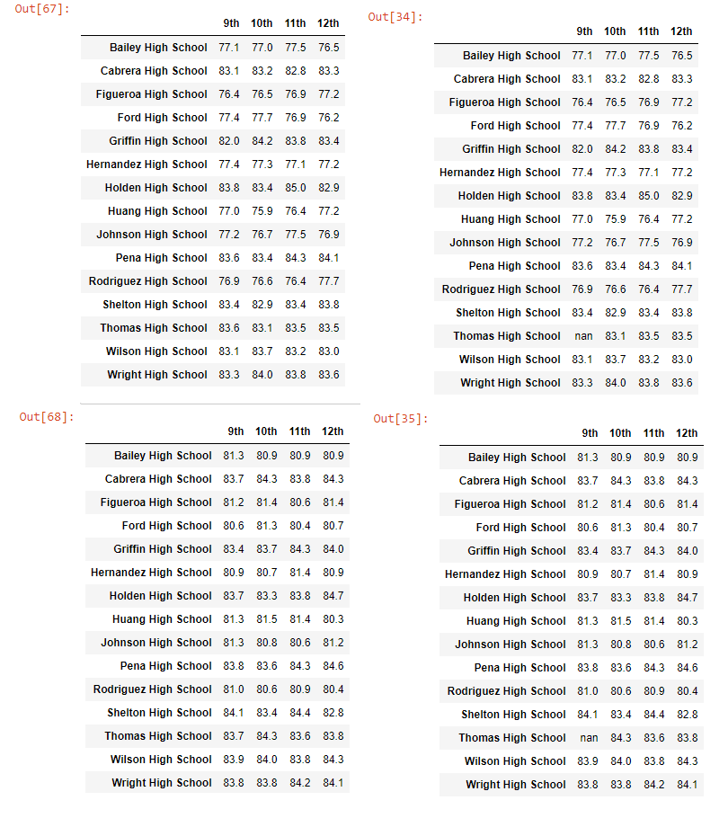
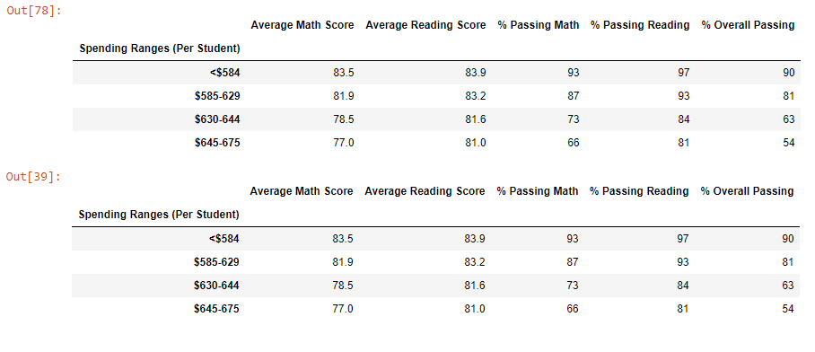
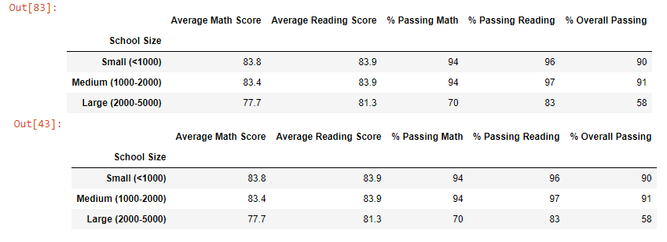
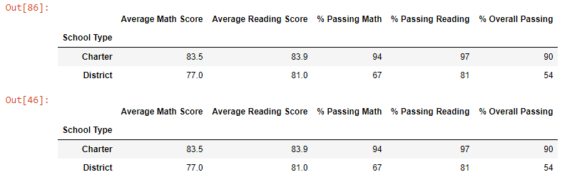

#  PyCitySchools with Pandas: an analysis of school performance based on test scores in math and reading
## Overview
Maria, the chief data scientist for a city school distinct, wants to analyze the performance of the districts’ schools based on standardized test scores.  This information will be presented to the school board, so they can make informed decisions about priorities and fund allocation.  I previously performed an analysis to determine the breakdown of reading and math test results by grade in each school, and examined how funding per student, school size (number of students), and school type (district or charter) affected these scores.  However, it has come to the board’s attention that there is evidence for academic dishonesty in the scores for ninth graders at Thomas High School.  Maria and the board would like to repeat the analysis with this group excluded to see whether dishonesty had an impact on the results for the Thomas High School’s rankings or the district at large.

## Analysis
Analysis was performed with `Python` 3.7 using the `pandas` and `numpy` libraries in `Jupyter Notebook`.  Raw data was collected for the [schools](Resources/schools_complete.csv) and [student scores](Resources/students_complete.csv).  Student names were modified to remove erroneous professional titles such as Dr., PhD, and MD.  Data was otherwise untransformed for the [original analysis](PyCitySchools.ipynb).  For the [reanalysis](PyCitySchools_Challenge.ipynb), the scores for all 9th graders from Thomas Highschool were set to nan.  Percentages and averages for Thomas Highschool were modified as needed to account for these removed data points.

## Results
- How is the district summary affected?
  - 

  - **Table 1:** District summary for original analysis (top) and reanalyzed data without Thomas High School 9th graders (bottom).  The Average Math Score, % Passing Math, % Passing Reading, and % Overall Passing dropped slightly, by less than .5%.

- How is the school summary affected?

  - 

  - **Table 2:** School summary for Thomas High School in the original analysis (top) and reanalyzed data without Thomas High School 9th graders (bottom). For Thomas High School, the Average Math score dropped slightly, while the average reading score increased slightly.  The % Passing Math, % Passing Reading, and % Overall Passing all dropped slightly.For Thomas High School, the Average Math score dropped slightly, while the Average Reading score increased slightly.  The % Passing Math, % Passing Reading, and % Overall Passing all dropped slightly.

- How does replacing the ninth graders’ math and reading scores affect Thomas High School’s performance relative to the other schools?
	- 
  - **Table 3:** Top five schools by overall passing percentage in the original analysis (top) and reanalyzed data without Thomas High School 9th graders (bottom).  Thomas High School’s relative rank was not affected; it is the second best school in both analyses.  However, Griffen high school's students are now slightly more likely to pass in reading, and the gap between percentage passing math between Griffen and Thomas High Schools has widened.

- How does replacing the ninth-grade scores affect the following:
  - Math and reading scores by grade
	  - 
	  - **Table 4:** School scores across grade levels for math (top tables) and reading (bottom tables) in the original analysis (left tables) and reanalyzed data without Thomas High School 9th graders (right tables).  Thomas High School now has nan for 9th grade reading and math instead of a value.  Otherwise, at the number of significant digits used to display values in these tables, there are no differences.

  - Scores by school spending
    - 
    - **Table 5:** Scores depending on dollars spend per student in the original analysis (top) and reanalyzed data without Thomas High School 9th graders (bottom).  At the number of significant digits used to display values in these tables, there are no differences.

  - Scores by school size
    - 
    - **Table 6:** Scores depending on number of students in a school in the original analysis (top) and reanalyzed data without Thomas High School 9th graders (bottom).  At the number of significant digits used to display values in these tables, there are no differences.

  - Scores by school type
    - 
    - **Table 7:** Scores depending on whether a school was a district or charter school in the original analysis (top) and reanalyzed data without Thomas High School 9th graders (bottom).  At the number of significant digits used to display values in these tables, there are no differences.

## Summary
For the district summary **(1)**, the average math score decreased slightly (difference: 0.1%) as did the percentage of students that passed reading (difference: 0.1%), math (difference: 0.2%), and overall (difference: 0.3%) (see **Table 1**)).  Interestingly, the average reading score appears to be unchanged even though the percent passing decreased.  Thomas High School summary **(2)** mirrors what was shown in the district analysis: a decrease in average math score (difference: 0.05), an increase in the average reading score (difference: 0.05), and decreases in math, reading, and overall passing percentages (differences: 0.1,  0.3, 0.3) (see **Table 2**).  Although Thomas High School's rank did not change, **(3)** it did see a decrease in percentage of students passing reading and math (see **Table 3**).  Perviously, Thomas High School had shown a higher percentage of students passing math than Griffin High School, but this was no longer the case (see **Table 3**). Interestingly, Thomas High School still has a higher overall passing percentage than Griffin High School.  The Math and Reading scores **(4)** for ninth graders at Thomas High School could no longer be calculated, as that data had been removed from the dataset (see **Table 4**).  This affected no other data points because no other catagory included these students.  No other metrics showed changes at the level of significant figures allowed in the originall analysis (see **Tables 5-7**).  Overall, removing the 9th grade data from Thomas High School had negligible effects on the analysis.  The new analysis suggests that there is no reason for the board to change any decisions they have made based on the original analysis.
